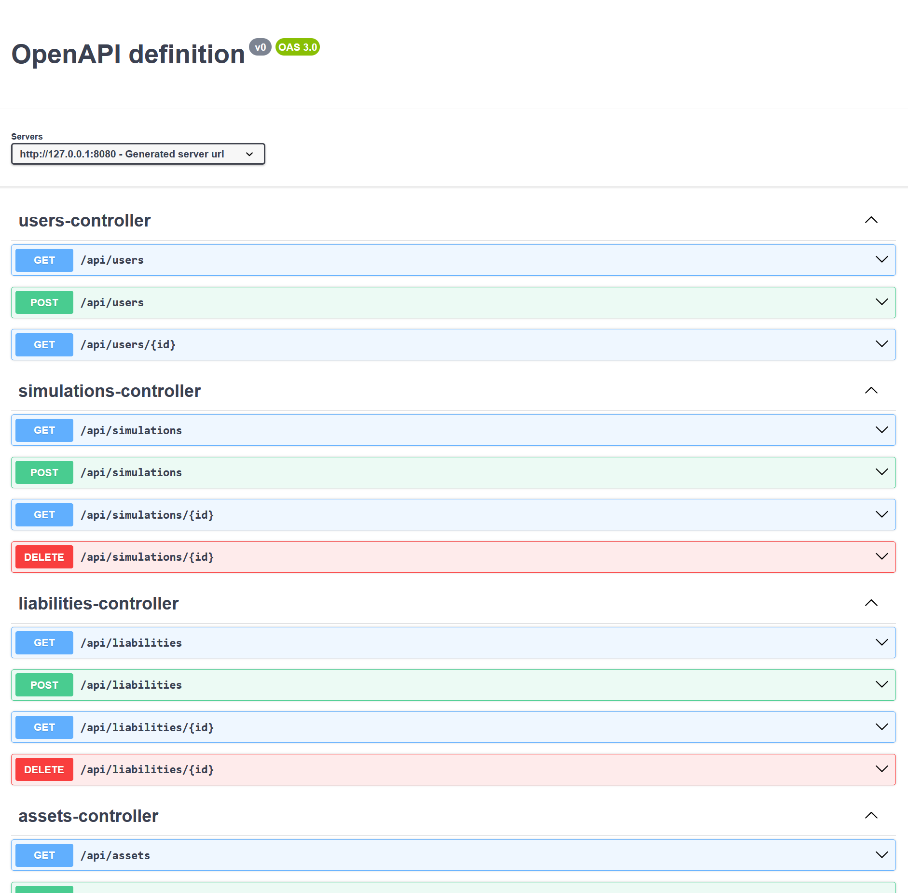

# Investment Simulator

_@CarlosFranciscoAnjos_

## How to Use

### Maven

```bash
mvn clean
mvn -D maven.test.skip=true package
java -jar target/*.jar
```

### Docker Compose

```bash
# create
docker compose -p investment-sim build
docker compose -p investment-sim up -V -d

# delete
docker compose -p investment-sim stop
docker compose -p investment-sim down -v

# status
docker compose -p investment-sim logs -f
```

## API Specification

### Resources

```
> BASIC AUTH
    admin:admin

> HEALTHCHECKS
    /
    /system

> CRUD OPERATIONS
    /users
    /simulations
    /assets
    /liabilities
```

### Swagger Specification

_[swagger.json](docs/swagger.json)_



### Postman Overview


## Application Design

### C2 Diagram


### Infrastructure Diagram


