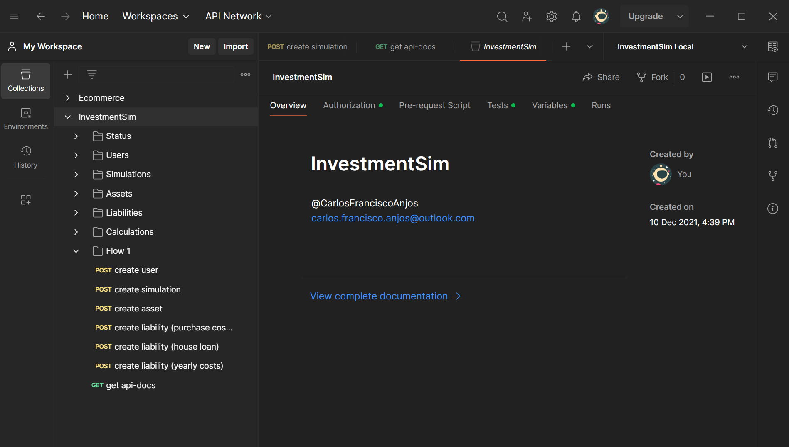

# Investment Simulator

_@CarlosFranciscoAnjos_

## How to Use

### Maven

```bash
mvn clean
mvn -Dmaven.test.skip=true package
java -jar target/*.jar
```

### Docker Compose

```bash
docker compose build
docker compose up

docker compose stop
docker compose down -v
```

## API Specification

### Resources

```
> BASIC AUTH
    admin:admin

> HEALTHCHECKS
    /
    /system

> CRUD OPERATIONS
    /users
    /simulations
    /assets
    /liabilities
```

### Swagger Specification


### Postman Overview



## Application Design

### C2 Diagram


### CI/CD Diagram


